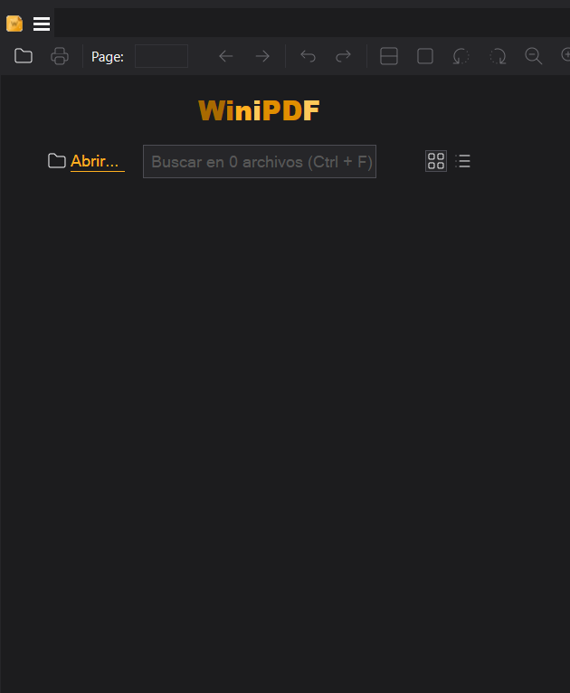
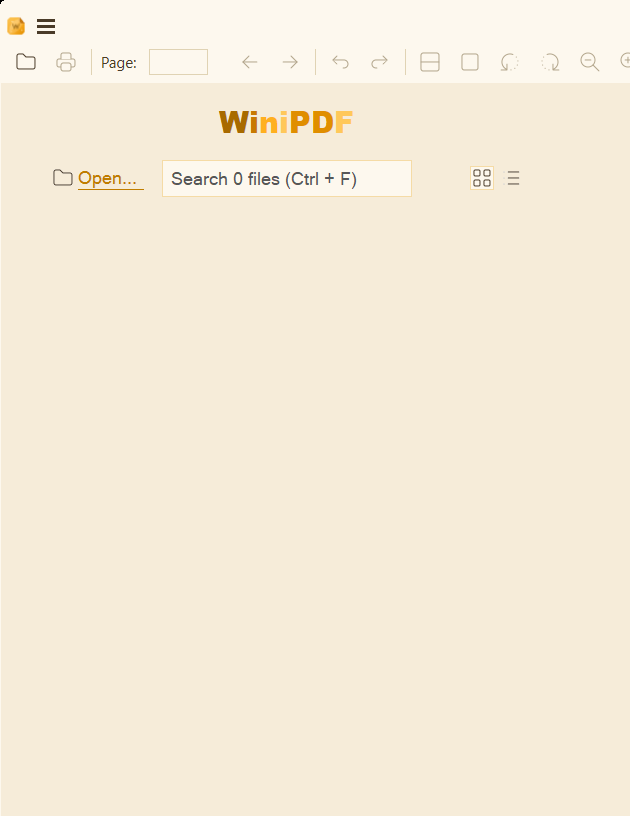

# WiniPDF

<p align="center"></p>

**Español** | [English below](#english)

---

## ¿Qué es WiniPDF?

Un lector de documentos rápido y ligero para Windows, con identidad visual
propia inspirada en el diseño moderno de Windows 11.

WiniPDF es un fork de **[SumatraPDF](https://github.com/sumatrapdfreader/sumatrapdf)**,
el mejor lector ligero de Windows, creado por **Krzysztof Kowalczyk** y su
comunidad. Todo el mérito del motor y décadas de refinamiento es suyo — este
proyecto existe gracias a ellos y les está profundamente agradecido.

### ¿Por qué "la piedra de ámbar"?

> *El ámbar encapsula y deja ver sin alterar. Eso es un PDF.*

El ámbar preserva lo que atrapa durante millones de años: visible, intacto,
intocable. Exactamente la promesa del formato PDF. Nuestro icono es una piedra
de ámbar estilizada con un pliegue de página, y dentro, una hoja con la W de
WiniPDF — preservada, como todo lo que abras con este lector.

El dúo negro + amarillo es además un homenaje a los colores de SumatraPDF.

<p align="center">
  &nbsp;
  
</p>
<p align="center"><sub>Temas propios <b>WiniCarbon</b> y <b>WiniAmber</b> — predeterminados según el modo claro/oscuro de Windows</sub></p>

### Lo que hereda de SumatraPDF

- Lectura de PDF, ePub, MOBI, XPS, DjVu, CHM, CBZ/CBR, FB2 y más
- Velocidad de apertura legendaria, sin esperas
- Versión portable, sin instalación
- Interfaz en decenas de idiomas

### Próximamente (roadmap)

- **Asistente IA integrado** (desactivado por defecto): resúmenes del documento,
  modo voz para accesibilidad, y proveedores conectables (elige tu IA)
- **Suite de edición de documentos** (desactivada por defecto): conversión de
  formatos, anotaciones avanzadas, estilo iLovePDF
- **Temas de la comunidad**: importa y comparte tus propios temas (estilo
  Obsidian)
- **Modernización visual Fluent**: pestañas estilo Windows 11, materiales Mica
- Versión portable oficial y publicación en Microsoft Store

### El ecosistema Wini (visión a futuro)

Si el proyecto crece, la misma filosofía Fluent + identidad propia llegará a:
un reproductor basado en VLC, un visor de fotos y videos moderno, y un cliente
de música basado en YouTube Music sin anuncios. Cada app con su personalidad,
todas compartiendo alma.

Las funciones experimentales nunca se activan sin tu consentimiento explícito:
el rendimiento es la razón número uno por la que existe este proyecto.

## Créditos

Este proyecto fue llevado a cabo en **[opencode](https://opencode.ai)** con la
IA **Ox Alpha Free** como cofundadora técnica: arquitectura del fork,
identidad visual, sistema de empaquetado, temas Wini, automatización de builds
y esta página son trabajo conjunto humano-IA. Sin ella, este proyecto no
existiría. Agradecemos a sus creadores y distribuidores por hacerla accesible.

**Base y corazón del motor**: [SumatraPDF](https://github.com/sumatrapdfreader/sumatrapdf)
por **Krzysztof Kowalczyk** y toda su comunidad de contribuidores, más los
autores de las librerías de terceros (MuPDF y demás, ver AUTHORS). Este fork
existe parado sobre sus hombros.

Humano cofundador y diseño del icono: **Osvaldo** ([@osvrangel03-ranger](https://github.com/osvrangel03-ranger)).

## Dona para impulsar el ecosistema

Si WiniPDF te resulta útil, considera apoyar el proyecto: las donaciones se
destinan íntegramente a **costear las suscripciones de IA y herramientas de
agentes** que hacen posible el desarrollo de WiniPDF y los próximos proyectos
del ecosistema Wini.

<p align="center">
  <a href="https://paypal.me/sald911">
    
  </a>
</p>

## Compilar

Requiere Visual Studio 2026 (carga de trabajo "Desarrollo para el escritorio
con C++") y [Bun](https://bun.sh):

```
bun cmd/build.ts -release
```

El ejecutable queda en `out/rel64/`.

## Licencia

GPLv3, heredada de SumatraPDF. Todos los créditos del código base pertenecen a
Krzysztof Kowalczyk, los contribuidores de SumatraPDF y los autores de las
librerías de terceros (ver AUTHORS).

---

<a id="english"></a>

# WiniPDF (English)

A fast, lightweight document reader for Windows with its own visual identity
inspired by modern Windows 11 design.

WiniPDF is a fork of **[SumatraPDF](https://github.com/sumatrapdfreader/sumatrapdf)**
— the best lightweight reader for Windows, created by **Krzysztof Kowalczyk**
and its community. All credit for the engine and decades of polish belongs to
them; this project exists thanks to them.

**Why the amber stone?** *Amber encapsulates and lets you see without altering.
That is what a PDF is.* Our icon is a stylized amber stone with a page fold;
inside, a leaf with the WiniPDF W — preserved, like everything you open with
this reader. The black + yellow duo also honors SumatraPDF's colors.

<p align="center">
  &nbsp;
  
</p>

Own **WiniCarbon** (dark) and **WiniAmber** (light) themes are the defaults,
following your Windows light/dark mode.

**Coming soon**: built-in AI assistant (off by default, voice accessibility
mode, pluggable providers), document editing suite, community themes, Fluent
visual modernization, official portable build and Microsoft Store release.

**Wini ecosystem vision**: the same Fluent philosophy and own identity will
reach a VLC-based player, a modern photo/video viewer, and an ad-free YouTube
Music client.

**Build**: Visual Studio 2026 (C++ desktop workload) + [Bun](https://bun.sh):
`bun cmd/build.ts -release` → `out/rel64/`.

**Credits**: built in [opencode](https://opencode.ai) with the **Ox Alpha
Free** AI as technical co-founder. Engine base by Krzysztof Kowalczyk and the
SumatraPDF community (GPLv3). Icon designed by
[@osvrangel03-ranger](https://github.com/osvrangel03-ranger).

**Donate**: donations fund the AI subscriptions that make this ecosystem
possible → [paypal.me/sald911](https://paypal.me/sald911)

**License**: GPLv3, inherited from SumatraPDF.
